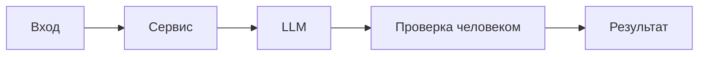

# ADR: решение для первого рабочего сценария

- Статус: proposed / accepted
- Дата: 2026-09-10
- Ответственные: команда студента, автор артефактов

## Контекст

Учебный кейс требует, чтобы сервис по одному HTTP-запросу с diff возвращал структурированный ответ для ревьюера: summary, до 3 рисков с evidence и список проверок. Должны соблюдаться ограничения SEC-1, API-1, REL-1, OUT-1, SCOPE-1, QA-1, OBS-1. Текущее состояние (TRAINING_PR.diff) не соответствует этим правилам: нет валидации, нет редактирования секретов, нет таймаута, формат ответа не по OUT-1.

## Решение

Минимально жизнеспособное решение для первого сценария:
- На уровне API — валидация тела запроса; 422 при отсутствии `diff`; 413 при `len(diff) > 20000` (API-1).
- Перед LLM — модуль редактирования секретов, заменяющий токены/ключи на `[REDACTED]` (SEC-1).
- Вызов LLM — с таймаутом 10 секунд и обработкой исключений; при срабатывании — контролируемый ответ (REL-1).
- Формирование ответа — структура OUT-1: `summary`, `risks` (<=3 с `file`, `line`, `evidence`, `risk`), `checks`. Риски включаются только при подтверждении строкой diff или правилом (QA-1). Логи содержат только `request_id`, длительность, статус (OBS-1).

## Рассмотренные альтернативы

| Альтернатива | Почему не выбрали сейчас |
|---|---|
| Асинхронная очередь и воркеры | Усложняет первый сценарий; в кейсе нет требования высокой пропускной способности. |
| Встраивание правок в GitHub (бот-комментарии) | Нарушает SCOPE-1 (запрещено выполнять действия в GitHub). |
| Стриминг ответа LLM | Не требуется для минимального сценария и усложняет проверку OUT-1. |

## Последствия и главный риск

- Положительные последствия:
  - Соблюдение правил репозитория; предсказуемый формат ответа; снижение операционных сбоев.
- Ограничения:
  - Возможен рост латентности из-за редактирования и валидаций; ограничение размера diff.
- Главный риск:
  - Неверная или недостаточная маскировка секретов (SEC-1) при новых паттернах.
- Как проверим риск:
  - Интеграционные тесты с различными шаблонами секретов; периодический review шаблонов редактирования.

## Архитектурная схема

## Как использовали AI

- Для чего: сформулировать минимальное решение, оставляя пространство для развития без нарушения SCOPE-1.
- Тип промпта: master prompt (структурирование ADR), без генерации кода.
- Строка в [`prompts.md`](prompts.md): P1-02 (Master Prompt v1).
- Что проверили и исправили сами: привязали каждый пункт решения к правилам CASE.md; добавили риск и способ его проверки.
