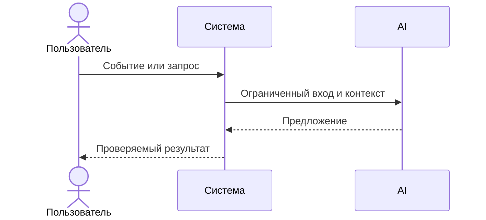

# Use cases и user stories

## Первый рабочий сценарий

**Когда** разработчик отправляет `POST /api/reviews` с валидным `diff` (<= 20 000 символов), **система** редактирует секреты, вызывает LLM с таймаутом 10 секунд и возвращает структурированный ответ формата OUT-1, **а пользователь получает** краткое резюме, до 3 подтверждённых рисков и список проверок. Источник: CASE.md (SEC-1, API-1, REL-1, OUT-1).

Не входит в этот сценарий:

- approve/merge, любые действия в GitHub; изменение кода PR. Источник: CASE.md (SCOPE-1).

## Use case

| Поле | Значение |
|---|---|
| Актор | Автор PR или ревьюер |
| Триггер | Запрос `POST /api/reviews` с JSON-телом `{"diff": "..."}` |
| Предусловия | Длина `diff` ≤ 20 000 символов; тело запроса содержит поле `diff` |
| Основной результат | JSON в формате OUT-1: `summary`, `risks` (до 3, с `file`, `line`, `evidence`, `risk`), `checks` |
| Ошибка или отказ | 413 при diff > 20 000; 422 при отсутствии `diff`; контролируемый ответ при таймауте/ошибке LLM (REL-1) |



## User stories и acceptance criteria

```gherkin
Feature: Получение структурированного ревью по diff

  Scenario: Позитивный — валидный короткий diff
    Given тело запроса JSON с полем diff длиной 1000 символов
    When отправляем POST /api/reviews
    Then ответ имеет код 200 и JSON содержит поля summary, risks (не более 3 элементов), checks
      And каждый элемент risks содержит file, line, evidence, risk

  Scenario: Негативный — отсутствует поле diff
    Given тело запроса JSON без поля diff
    When отправляем POST /api/reviews
    Then ответ имеет код 422

  Scenario: Граничный — превышение лимита API-1
    Given тело запроса JSON с полем diff длиной 20001 символ
    When отправляем POST /api/reviews
    Then ответ имеет код 413
```

## Как использовали AI

- Для чего: оформить сценарий, use case и критерии приёмки на основании CASE.md и TRAINING_PR.diff.
- Тип промпта: master prompt (структура, формализация AC), без генерации кода.
- Строка в [`prompts.md`](prompts.md): P1-02 (Master Prompt v1).
- Что проверили и исправили сами: выровняли AC с OUT-1, API-1 и REL-1; добавили негативные и граничные случаи; исключили действий вне SCOPE-1.
