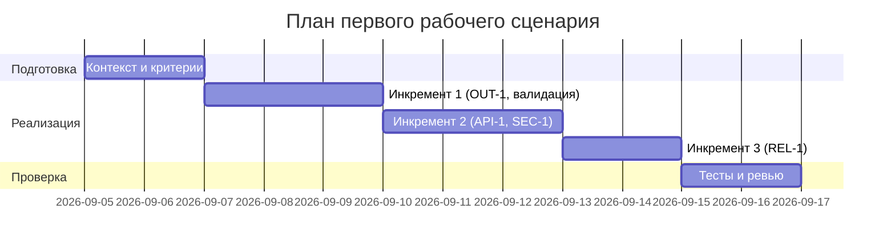

# План поставки

## Инкременты и ответственность

| Инкремент | Наблюдаемый результат | Что делает человек | Что делает AI или субагент | Проверка | Зависимости |
|---|---|---|---|---|---|
| 1 | Валидация тела запроса и формат OUT-1 на выходе | Определяет контракт OUT-1, добавляет схему/валидацию | Генерирует шаблон ответа и проверки формата | Unit-тесты структуры ответа; e2e без diff -> 422 | Context Pack, OUT-1 |
| 2 | Ограничение размера diff (API-1) и редактирование секретов (SEC-1) | Уточняет правила редактирования | Настраивает фильтры шаблонов секретов | Нагрузочный тест >20k -> 413; интеграционный тест редактирования | Инкремент 1 |
| 3 | Таймаут LLM и контролируемый ответ (REL-1) | Определяет формат контролируемого ответа | Эмулирует таймаут и шаблоны ответов | Интеграционный тест с заглушкой LLM | Инкремент 1 |

## Диаграмма Ганта

Замените даты и задачи на свой план.

## Как использовали AI

- Для чего: разложить поставку на инкременты с проверками и зависимостями.
- Тип промпта: master prompt (структурирование плана), без генерации кода.
- Строка в [`prompts.md`](prompts.md): P1-02 (Master Prompt v1).
- Что проверили и исправили сами: сопоставили инкременты с правилами CASE.md (OUT-1, API-1, SEC-1, REL-1); проверили, что проверки воспроизводимы тестами.
