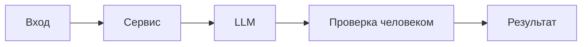

# ReAct

- Цель: проверить соответствие архитектурной схемы ADR тексту решения и правилам CASE.md; подготовить обоснованное предложение схемы без изменения ADR.
- Доступные входы: practices/practice_01/adr.md; practices/practice_01/CASE.md.
- Разрешённые действия: читать конкретные разделы ADR и CASE.md; искать в них нужные правила и формулировки; составлять предложение схемы Mermaid; сопоставлять предложение с источниками; исправлять своё предложение.
- Запрещённые действия: веб-поиск и внешние API; чтение других экспериментов; изменение исходных документов или кода приложения; запуск приложения; выдуманные наблюдения.
- Максимальное число шагов: 6.
- Условие остановки и вопроса человеку: предложенная схема подготовлена; соответствие её узлов и переходов проверено по ADR и CASE.md; новые предложения и неопределённости явно отмечены. При противоречии источников или необходимости дополнительного решения — зафиксировать конкретный вопрос автору ADR.

## Запрос

Примени ReAct к задаче проверки архитектурной схемы в practices/practice_01/adr.md.

Цель: выяснить, соответствует ли схема тексту решения и применимым правилам CASE.md, затем подготовить обоснованное предложение схемы. Сам ADR изменять нельзя.

Доступные входы:
- practices/practice_01/adr.md;
- practices/practice_01/CASE.md.

Разрешённые действия:
- читать конкретные разделы этих файлов;
- искать в них нужные правила и формулировки;
- составлять предложение схемы Mermaid;
- сопоставлять предложенную схему с источниками;
- исправлять собственное предложение.

Запрещённые действия:
- веб-поиск и внешние API;
- чтение других экспериментов;
- изменение исходных документов или кода приложения;
- запуск приложения;
- выдумывание наблюдений, результатов инструментов или проведённого ревью.

Работай циклом:
действие → фактическое наблюдение → краткое решение о следующем действии.

Следующее действие выбирай по результату предыдущего. Не заполняй заранее выдуманный сценарий успешного выполнения.

Первое действие: прочитать разделы «Решение» и «Архитектурная схема» ADR.

Далее:
- если обнаружено расхождение — прочитай нужные правила CASE.md и уточни, что должно быть отражено;
- если схема соответствует тексту — проверь это по применимым правилам и не придумывай недостатки;
- если поведение не определено источниками — обозначь его как неопределённое или как предложение, а не как существующее решение;
- после подготовки схемы проверь её по тексту ADR и CASE.md; при обнаружении ошибки исправь предложение.

Ограничение: максимум 6 шагов самого эксперимента. Шаг — отдельное действие чтения, поиска, подготовки или проверки с зафиксированным результатом. Подготовка отчёта и сохранение файлов в этот лимит не входят.

Условие успешной остановки:
подготовлено предложение схемы, проверено соответствие её узлов и переходов источникам, явно обозначены новые предложения и неопределённости.

Если лимит достигнут раньше:
остановись, сохрани частичный результат и перечисли, что не проверено. Не объявляй эксперимент завершённым успешно.

Если источники противоречат друг другу или без дополнительного решения невозможно закончить схему:
зафиксируй конкретный вопрос автору ADR. Не подменяй отсутствующий ответ предположением.

Для каждого шага сохрани:
1. Выполненное действие.
2. Фактическое наблюдение: найденный фрагмент, созданное предложение или обнаруженное несоответствие.
3. Краткое решение: что делать дальше или почему остановиться.

Чтение файлов выполняй доступными инструментами. Не выдавай мысленное предположение о файле за результат его чтения.

Для схемы:
- сохраняй границы первого сценария;
- отражай только подтверждённые этапы либо явно отмеченные предложения;
- не добавляй очереди, повторные вызовы и действия в GitHub без основания;
- не придумывай HTTP-коды, которых нет в ADR;
- показывай контролируемый ответ при ошибке LLM, если это предусмотрено источниками;
- сохраняй принятие окончательного решения человеком.

## Наблюдаемые действия и результаты

| Шаг | Действие | Наблюдение | Решение продолжить или остановиться |
|---|---|---|---|
| 1 | Прочитать ADR — «Решение» и «Архитектурная схема» | «Минимально жизнеспособное решение…» с пунктами: валидация и 422/413 (API-1), редактирование секретов (SEC-1), вызов LLM с таймаутом 10s и контролируемый ответ (REL-1), формирование ответа OUT-1 и ограничения QA-1/OBS-1. Текущая схема: `Input -> Service -> LLM -> Проверка человеком -> Результат`. | Обнаружены несоответствия по деталям (нет редактирования, таймаута/контролируемого ответа, структуры OUT-1). Перейти к правилам CASE.md для уточнения обязательных этапов. |
| 2 | Прочитать CASE — применимые правила | Найдены правила: SEC-1 (редактирование секретов), API-1 (413 при >20000), REL-1 (timeout 10s и контролируемый ответ), OUT-1 (структура ответа: summary, risks<=3 с file/line/evidence/risk, checks), SCOPE-1 (решение принимает человек), QA-1, OBS-1. | Зафиксировать, что эти этапы должны быть отражены; подготовить предложенную схему, добавив подтверждённые узлы и переходы. |
| 3 | Подготовить предложенную схему Mermaid | Составлена схема с узлами: валидация API (422 при отсутствии diff; 413 при len>20000), редактирование секретов (SEC-1), вызов LLM (timeout 10s) с веткой контролируемого ответа (REL-1), формирование OUT-1, проверка и решение человеком. | Перейти к проверке предложения по ADR и CASE; отметить, что 422 — решение ADR (не правило CASE). |
| 4 | Сопоставить предложение с ADR — «Решение» | Узлы соответствуют: валидация/422/413 — ADR: «валидация… 422… 413…»; редактирование — ADR: «модуль редактирования секретов…»; timeout/контролируемый ответ — ADR: «таймаут 10 секунд и обработка исключений…»; формирование OUT-1 — ADR: «структура OUT-1…»; человеческая проверка — исходная схема и CASE. | Перейти к проверке по CASE для подтверждения правил SEC-1, API-1, REL-1, OUT-1, SCOPE-1; уточнить ограничения (не добавлять очереди/стриминг). |
| 5 | Сопоставить предложение с CASE — «Правила репозитория» и «Задача помощника» | CASE подтверждает: SEC-1, API-1 (413), REL-1 (timeout 10s и контролируемый ответ), OUT-1 (формат), SCOPE-1 (решение принимает человек). 422 отсутствует в CASE — остаётся как решение ADR. Очереди/стриминг/действия в GitHub исключены (альтернативы ADR и SCOPE-1). | Условия остановки выполнены: предложенная схема отражает подтверждённые этапы и явно отмеченные предложения; неопределённостей и противоречий не выявлено. Остановиться. |

### Исходная схема



### Предложенная схема

```mermaid
flowchart LR
    Client[HTTP запрос: diff] --> Validation{Валидация API}
    Validation -- отсутствует diff --> HTTP422[HTTP 422]
    Validation -- len(diff) > 20000 --> HTTP413[HTTP 413]
    Validation --> Redact[Редактирование секретов [SEC-1]]
    Redact --> LLMCall[Вызов LLM (timeout 10s)]
    LLMCall -- timeout/исключение --> Controlled[Контролируемый ответ [REL-1]]
    LLMCall --> Format[Формирование ответа OUT-1]
    Controlled --> Format
    Format --> Human[Проверка человеком]
    Human --> Decision[Решение человеком]
```

### Краткая проверка изменений по источникам

- Валидация и коды 422/413: ADR — «На уровне API — валидация тела запроса; 422 при отсутствии `diff`; 413 при `len(diff) > 20000` (API-1).» 422 указано как решение ADR; 413 — правило CASE API-1.
- Редактирование секретов: ADR — «Перед LLM — модуль редактирования секретов… (SEC-1)»; CASE SEC-1.
- Таймаут и контролируемый ответ: ADR — «Вызов LLM — с таймаутом 10 секунд и обработкой исключений; при срабатывании — контролируемый ответ (REL-1).»; CASE REL-1 подтверждает 10s и контролируемый ответ.
- Формат OUT-1 и ограничения QA-1: ADR — «Формирование ответа — структура OUT-1…»; CASE OUT-1/QA-1.
- Принятие решения человеком: исходная схема ADR и CASE — [Задача помощника](../../practice_01/CASE.md#задача-помощника): «Решение всегда принимает человек.» SCOPE-1 соблюдён.

### Результат остановки

Условие остановки выполнено: подготовлена и проверена предложенная схема; новые элементы отмечены как предложение ADR (422) или как подтверждённые правила CASE (SEC-1, API-1, REL-1, OUT-1, SCOPE-1). Неопределённостей и противоречий не выявлено; ADR не изменён.

## Что изменили в исходном артефакте

- Файл и раздел: [ADR — Архитектурная схема](../../practice_01/adr.md#архитектурная-схема)
- Изменение: ADR не изменяли; подготовлено предложение. Предложенные уточнения схемы: добавить явные этапы «Валидация API (422 при отсутствии diff; 413 при len>20000)», «Редактирование секретов (SEC-1)», «Вызов LLM (timeout 10s) с контролируемым ответом при ошибке (REL-1)», «Формирование ответа в формате OUT-1», «Проверка человеком и итоговое решение человеком». Исходная схема сохранена ниже для сравнения; предложение не внесено в ADR.
- Как проверили: сопоставление узлов и переходов с ADR — [Решение](../../practice_01/adr.md#решение) и CASE — [Правила репозитория](../../practice_01/CASE.md#правила-репозитория), [Задача помощника](../../practice_01/CASE.md#задача-помощника). Визуальный рендер Mermaid не выполнялся; приложение и тесты не запускались.
- Что отклонили: отсутствуют не подтверждённые источниками элементы (очереди, стриминг, действия в GitHub, дополнительные HTTP-коды, логирование содержимого). Эти варианты отклонены как противоречащие ADR/CASE или выходящие за рамки первого сценария.
